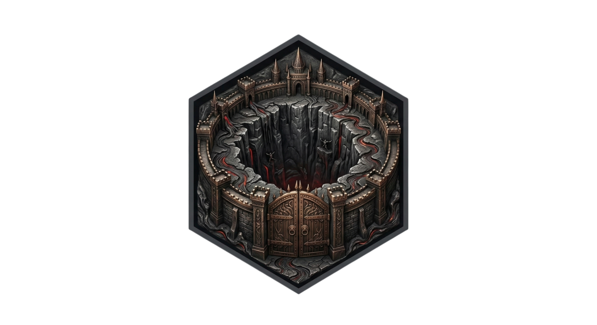

<p align="center">
  
</p>

# Tartarus

**What we're doing:** A lightweight way to restrict what specific processes can do without putting them in a container or a full sandbox. Policy is declarative (roles + a small bitmap of flags); enforcement lives in the kernel via BPF and LSM hooks. 

**Inspiration:** [BpfJailer: eBPF Mandatory Access Control](https://lpc.events/event/19/contributions/2159/attachments/1833/3929/BpfJailer%20LPC%202025.pdf) (LPC 2025). Tartarus is a minimal take on those ideas and nowhere near the scope of Meta's BpfJailer.

The pit below: enroll a PID and LSM hooks (e.g. `file_open`) enforce what it can do. Policy comes from `config/policy.json`. Go + cilium/ebpf.

We rewrote the original Python/BCC prototype. BPF is now plain C, compiled with clang and embedded via bpf2go—no BCC. Policy comes from `config/policy.json`; the daemon loads it and fills the `role_flags` map. Forked children stay in the pit via a `task_alloc` hook that copies the parent’s pod/role/flags. Enrollment is two-phase: the daemon puts the process in a pending map, and on its next syscall the BPF side migrates it into task-local storage, so we don’t need the PID at load time.

## Requirements

- Go, clang
- Linux kernel 5.7+ with LSM BPF (`CONFIG_BPF_LSM=y`, `lsm=bpf` in boot params)
- Root to load and attach BPF

On macOS, run inside a Lima VM (or similar); BPF is Linux-only.

## Build

```bash
make build
```

Binaries land in `bin/` (tartarus-daemon, tartarus-client, tartarus-bootstrap). The Makefile runs `go generate` to rebuild the embedded BPF if needed.

## Usage

```bash
sudo ./bin/tartarus-daemon --pid <TGID> [--pod 1] [--role 1] [--policy config/policy.json]
```

- `--pid` — (required) TGID of the process to send to the pit
- `--pod` — pod ID (default 1)
- `--role` — role ID; matches order in policy (1 = first role, 2 = second, …)
- `--policy` — path to JSON policy (default `config/policy.json`)

Ctrl+C detaches and exits.

Right now you hand the daemon a PID. The plan is to drop the manual step: processes will be put in the pit automatically (e.g. by cgroup or at exec), and the daemon will just run policy and keep the BPF attached.

## Project structure

| Path | Purpose |
|------|--------|
| `cmd/tartarus-daemon` | Daemon: load BPF, attach LSM, apply policy, enroll one PID in the pit, block until exit |
| `bpf/jailer.bpf.c` | LSM programs (`file_open`, `task_alloc`) and maps |
| `internal/policy` | Parse JSON and convert roles to the u8 bitmap BPF expects |
| `internal/bpf` | Generated by bpf2go; do not edit (use `make generate`) |
| `config/policy.json` | Default role definitions |
| `legacy/` | Original Python/BCC prototype |
| `docs/` | Design notes (roles, pending enrollments, inheritance in the pit, etc.) |

## License

MIT
